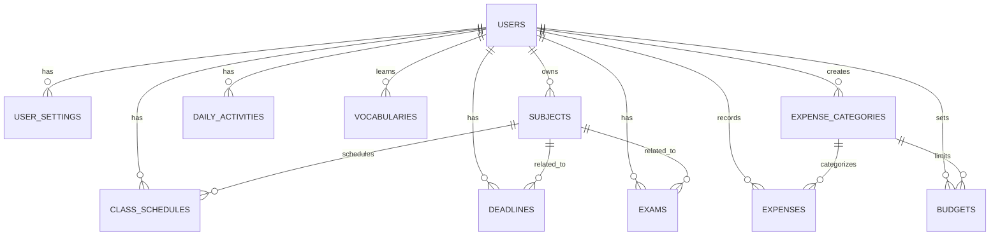
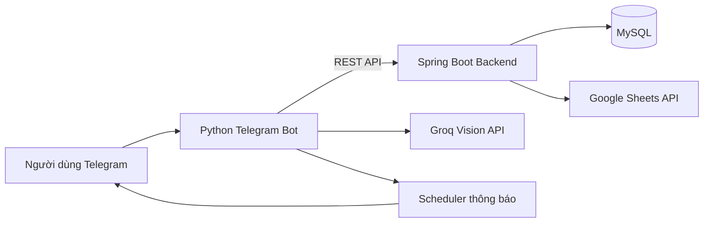
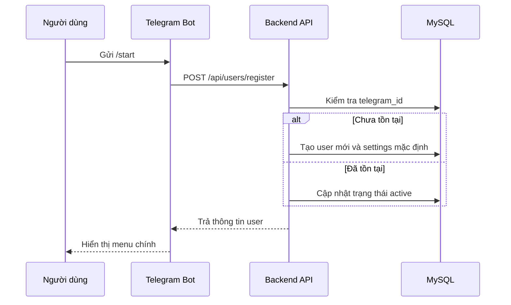
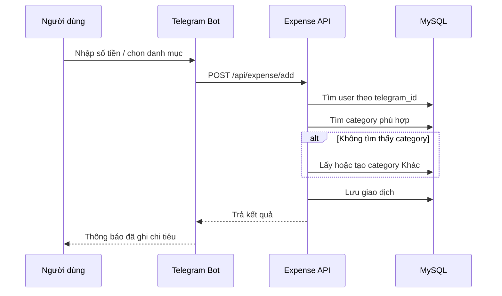
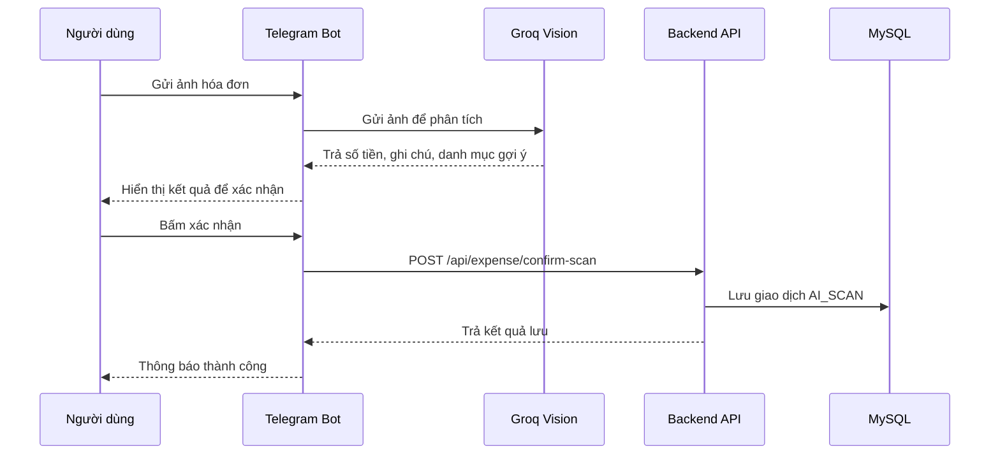
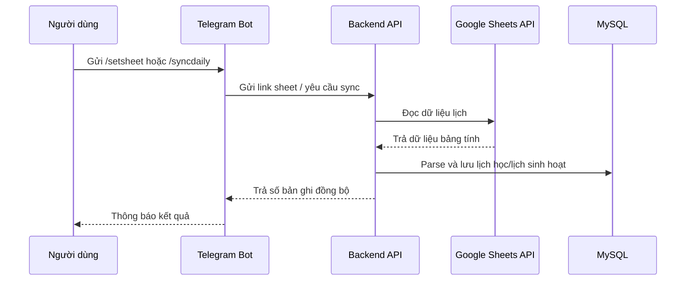
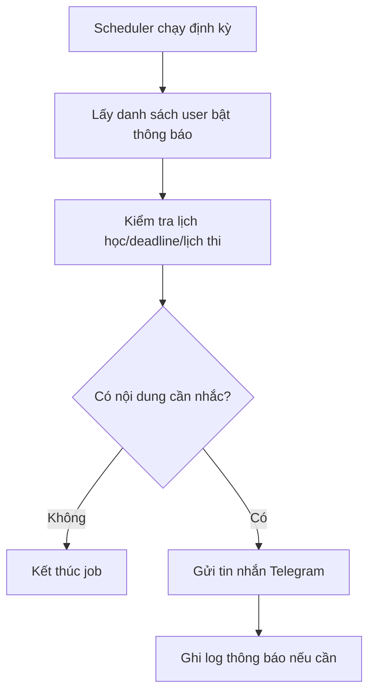

# BÁO CÁO DỰ ÁN HUSTStudy Bot

## LỜI NÓI ĐẦU

Trong quá trình học tập, sinh viên thường phải theo dõi nhiều loại thông tin cùng lúc như thời khóa biểu, deadline bài tập, lịch thi, sự kiện của trường, từ vựng cần ôn tập và chi tiêu cá nhân. Nếu quản lý các thông tin này rời rạc bằng giấy ghi chú, nhiều ứng dụng khác nhau hoặc các file bảng tính riêng lẻ, sinh viên dễ bỏ sót lịch học, quên hạn nộp bài hoặc khó kiểm soát tài chính cá nhân.

Từ thực tế đó, đề tài **HUSTStudy Bot** được xây dựng nhằm tạo ra một trợ lý học tập và quản lý cá nhân trên nền tảng Telegram. Người dùng có thể thao tác trực tiếp qua giao diện chat quen thuộc để xem lịch học, quản lý deadline, lịch thi, học từ vựng, ghi nhận chi tiêu và nhận thông báo nhắc nhở tự động.

Dự án được triển khai theo mô hình client - server. Phần client là Telegram Bot viết bằng Python, đảm nhiệm giao diện tương tác với người dùng. Phần server là backend Spring Boot, đảm nhiệm xử lý nghiệp vụ, lưu trữ dữ liệu, đồng bộ Google Sheets và cung cấp REST API. Dữ liệu được lưu trong MySQL, quản lý thay đổi cấu trúc bằng Flyway và có thể chạy local bằng Docker Compose.

---

## 1. PHÂN TÍCH BÀI TOÁN

### 1.1. Mục tiêu bài toán

Hệ thống cần hỗ trợ sinh viên quản lý các thông tin học tập và sinh hoạt cá nhân thông qua Telegram Bot. Các mục tiêu chính:

- Cung cấp một giao diện đơn giản, dễ dùng qua Telegram.
- Lưu trữ thông tin cá nhân theo từng người dùng Telegram.
- Hỗ trợ quản lý lịch học, lịch sinh hoạt, deadline và lịch thi.
- Hỗ trợ học từ vựng tiếng Anh theo cơ chế ôn tập lặp lại ngắt quãng.
- Hỗ trợ quản lý chi tiêu cá nhân, danh mục chi tiêu, ngân sách và báo cáo.
- Hỗ trợ quét hóa đơn bằng AI để tự động nhận diện số tiền, ghi chú và danh mục.
- Hỗ trợ nhắc nhở tự động thông qua các job định kỳ.
- Có thể triển khai local dễ dàng bằng Docker.

### 1.2. Đối tượng sử dụng

Đối tượng sử dụng chính là sinh viên, đặc biệt là sinh viên HUST có nhu cầu:

- Theo dõi thời khóa biểu và lịch sinh hoạt hằng ngày.
- Nhận nhắc nhở trước giờ học, deadline và lịch thi.
- Quản lý các khoản chi tiêu, thu nhập và ngân sách cá nhân.
- Ôn tập từ vựng tiếng Anh.
- Đồng bộ dữ liệu lịch từ Google Sheets.

### 1.3. Các chức năng chính

#### Nhóm chức năng người dùng

- Đăng ký tài khoản khi dùng lệnh `/start`.
- Lưu thông tin Telegram ID, username, họ tên, trạng thái hoạt động.
- Cài đặt bật/tắt các loại thông báo.
- Lưu cấu hình Google Sheet cá nhân.

#### Nhóm chức năng học tập

- Đồng bộ thời khóa biểu và lịch sinh hoạt từ Google Sheets.
- Xem lịch học/lịch sinh hoạt hôm nay.
- Xem lịch sinh hoạt cả tuần.
- Quản lý deadline: thêm, xem, đánh dấu hoàn thành.
- Quản lý lịch thi: thêm và xem danh sách lịch thi.
- Theo dõi sự kiện HUST CTSV và tạo nhắc nhở liên quan.

#### Nhóm chức năng từ vựng

- Thêm từ vựng mới.
- Xem danh sách từ đã lưu.
- Làm quiz ôn tập.
- Cập nhật kết quả học để tính lần ôn tiếp theo.

#### Nhóm chức năng chi tiêu

- Ghi chi tiêu/thu nhập bằng lệnh hoặc tin nhắn nhanh.
- Quản lý danh mục chi tiêu cá nhân.
- Có danh mục mặc định `Khác` để lưu giao dịch khi chưa có danh mục phù hợp.
- Sửa/xóa danh mục tự tạo.
- Xem danh sách giao dịch theo danh mục.
- Sửa/xóa từng giao dịch ngay trong Telegram.
- Xem báo cáo chi tiêu theo tháng.
- Đặt ngân sách theo danh mục.
- Quét hóa đơn bằng AI Groq Vision.

### 1.4. Yêu cầu phi chức năng

- Hệ thống phải phân tách dữ liệu theo từng người dùng.
- Backend cần cung cấp API rõ ràng để bot gọi.
- Dữ liệu cần lưu bền vững trong cơ sở dữ liệu quan hệ.
- Có khả năng chạy lại migration tự động khi deploy.
- Bot phải phản hồi nhanh và dễ thao tác trên Telegram.
- Cấu hình nhạy cảm như token, API key, mật khẩu DB phải lấy từ biến môi trường.

---

## 2. GIỚI THIỆU CÔNG NGHỆ

### 2.1. Python Telegram Bot

Phần bot được viết bằng Python, sử dụng thư viện `python-telegram-bot`. Thành phần này có nhiệm vụ:

- Nhận lệnh từ người dùng Telegram.
- Hiển thị ReplyKeyboard và InlineKeyboard.
- Xử lý callback khi người dùng bấm nút.
- Gửi HTTP request sang backend.
- Nhận ảnh hóa đơn, gọi Groq Vision để phân tích ảnh.
- Gửi thông báo nhắc nhở thông qua scheduler.

Các thư mục chính:

- `bot/main.py`: điểm khởi động bot và đăng ký handler.
- `bot/handlers/`: xử lý command, menu, callback.
- `bot/services/api_client.py`: client gọi REST API backend.
- `bot/services/groq_vision.py`: xử lý AI scan hóa đơn.
- `bot/services/scheduler.py`: cấu hình các job nhắc nhở.

### 2.2. Spring Boot Backend

Backend được xây dựng bằng Java Spring Boot. Đây là tầng xử lý nghiệp vụ và cung cấp REST API cho bot.

Các thành phần chính:

- Controller: nhận request từ bot.
- Service: xử lý logic nghiệp vụ.
- Repository: truy vấn database thông qua Spring Data JPA.
- Entity: ánh xạ bảng dữ liệu MySQL.

Một số module chính:

- `user`: quản lý người dùng và cấu hình thông báo.
- `expense`: quản lý chi tiêu, danh mục, ngân sách, Groq key.
- `deadline`: quản lý deadline.
- `exam`: quản lý lịch thi.
- `vocabulary`: quản lý từ vựng và quiz.
- `sheets`: đồng bộ dữ liệu từ Google Sheets.
- `schedule`: quản lý lịch học/lịch sinh hoạt.

### 2.3. MySQL

MySQL được dùng làm hệ quản trị cơ sở dữ liệu chính. Dữ liệu lưu trữ gồm:

- Người dùng Telegram.
- Môn học, thời khóa biểu, lịch sinh hoạt.
- Deadline, lịch thi.
- Từ vựng và kết quả quiz.
- Danh mục chi tiêu, giao dịch, ngân sách.
- Cấu hình thông báo và Google Sheet.

### 2.4. Flyway

Flyway dùng để quản lý migration database. Khi backend khởi động, Flyway tự động chạy các file trong:

```text
backend/src/main/resources/db/migration
```

Ví dụ:

- `V1__init_schema.sql`: tạo schema ban đầu.
- `V6__add_ai_scan_to_expenses.sql`: bổ sung trường liên quan AI scan.
- `V9__add_hust_autosync.sql`: bổ sung tự động đồng bộ sự kiện HUST.
- `V15__cleanup_seeded_user_expense_categories.sql`: dọn danh mục mẫu cũ và giữ danh mục `Khác`.

### 2.5. Docker và Docker Compose

Dự án hỗ trợ chạy local bằng Docker Compose với các service:

- `mysql`: cơ sở dữ liệu MySQL 8.0.
- `backend`: Spring Boot API.
- `bot`: Telegram Bot Python.
- `phpmyadmin`: giao diện quản trị DB, bật bằng profile dev.

Docker giúp việc cài đặt môi trường nhanh hơn, giảm lỗi khác biệt giữa các máy.

### 2.6. Google Sheets API và Groq Vision

- Google Sheets API: dùng để đọc dữ liệu lịch học/lịch sinh hoạt từ sheet cá nhân của người dùng.
- Groq Vision API: dùng để phân tích ảnh hóa đơn, nhận diện số tiền, nội dung và gợi ý danh mục chi tiêu.

---

## 3. THIẾT KẾ CƠ SỞ DỮ LIỆU

### 3.1. Tổng quan thiết kế

Cơ sở dữ liệu được thiết kế theo mô hình quan hệ. Hầu hết bảng nghiệp vụ đều liên kết với bảng `users` thông qua `user_id`, giúp dữ liệu của từng người dùng được tách biệt.

Các nhóm bảng chính:

- Nhóm người dùng: `users`, `user_settings`.
- Nhóm lịch học: `subjects`, `class_schedules`, `class_sessions`, `daily_activities`.
- Nhóm deadline/lịch thi: `deadlines`, `exams`.
- Nhóm từ vựng: `vocabularies`, `vocab_sessions`, `vocab_answers`.
- Nhóm chi tiêu: `expense_categories`, `expenses`, `budgets`.
- Nhóm thông báo: `notification_logs`.

### 3.2. Các bảng chính

#### Bảng `users`

Lưu thông tin người dùng Telegram.

Các trường quan trọng:

- `id`: khóa chính.
- `telegram_id`: ID Telegram, duy nhất.
- `username`: username Telegram.
- `full_name`: tên hiển thị.
- `language_code`: ngôn ngữ.
- `timezone`: múi giờ.
- `is_active`: trạng thái còn dùng bot hay không.

#### Bảng `user_settings`

Lưu cài đặt cá nhân của người dùng.

Các trường quan trọng:

- `user_id`: liên kết người dùng.
- `sheet_url`: link Google Sheet cá nhân.
- Các cờ bật/tắt thông báo: lịch học, deadline, lịch thi, bản tin sáng, sự kiện HUST.

#### Bảng `subjects`

Lưu danh sách môn học.

Các trường quan trọng:

- `user_id`: người sở hữu môn học.
- `name`: tên môn học.
- `code`: mã môn.
- `teacher`: giảng viên.
- `room`: phòng học.
- `credits`: số tín chỉ.

#### Bảng `class_schedules`

Lưu thời khóa biểu theo tuần.

Các trường quan trọng:

- `subject_id`: môn học.
- `user_id`: người dùng.
- `day_of_week`: thứ trong tuần.
- `start_time`, `end_time`: thời gian học.
- `room`: phòng học.
- `remind_before`: thời gian nhắc trước.

#### Bảng `daily_activities`

Lưu lịch sinh hoạt cá nhân hoặc hoạt động theo ngày. Bảng này hỗ trợ người dùng quản lý các hoạt động ngoài lịch học.

#### Bảng `deadlines`

Lưu deadline bài tập/công việc.

Các trường quan trọng:

- `user_id`: người dùng.
- `subject_id`: môn học liên quan, có thể null.
- `title`: tiêu đề deadline.
- `description`: mô tả.
- `due_date`: hạn nộp.
- `priority`: mức độ ưu tiên.
- `status`: trạng thái `PENDING`, `DONE`, `OVERDUE`.
- `is_notified`: đã nhắc hay chưa.

#### Bảng `exams`

Lưu lịch thi.

Các trường quan trọng:

- `user_id`: người dùng.
- `subject_name`: tên môn thi.
- `exam_date`: ngày thi.
- `start_time`: giờ bắt đầu.
- `room`: phòng thi.
- `exam_type`: loại bài thi.
- `remind_days`: số ngày nhắc trước.

#### Bảng `vocabularies`

Lưu từ vựng tiếng Anh.

Các trường quan trọng:

- `word`: từ tiếng Anh.
- `meaning`: nghĩa tiếng Việt.
- `example`: ví dụ.
- `next_review_at`: lần ôn tiếp theo.
- `review_interval`: khoảng cách ôn.
- `ease_factor`: hệ số ghi nhớ.
- `times_seen`, `times_correct`: thống kê học tập.

#### Bảng `expense_categories`

Lưu danh mục thu/chi.

Các trường quan trọng:

- `user_id`: người sở hữu danh mục. Nếu null là danh mục hệ thống.
- `name`: tên danh mục.
- `icon`: biểu tượng.
- `type`: `EXPENSE`, `INCOME`, `BOTH`.
- `is_default`: danh mục mặc định.
- `is_active`: còn hoạt động hay đã xóa mềm.

Trong phiên bản hiện tại, hệ thống giữ danh mục mặc định `Khác` cho từng người dùng để đảm bảo khi AI hoặc người dùng chưa chọn được danh mục thì giao dịch vẫn được lưu vào một nơi hợp lệ.

#### Bảng `expenses`

Lưu giao dịch thu/chi.

Các trường quan trọng:

- `user_id`: người dùng.
- `category_id`: danh mục.
- `type`: loại giao dịch `EXPENSE` hoặc `INCOME`.
- `amount`: số tiền.
- `note`: ghi chú.
- `transaction_at`: thời điểm giao dịch.
- `source`: nguồn nhập, ví dụ nhập tay hoặc AI scan.
- `ai_confidence`: độ tin cậy của AI nếu giao dịch đến từ quét hóa đơn.

#### Bảng `budgets`

Lưu ngân sách theo tháng cho từng danh mục.

Các trường quan trọng:

- `user_id`: người dùng.
- `category_id`: danh mục.
- `month`, `year`: kỳ ngân sách.
- `amount`: hạn mức.
- `warn_threshold`: ngưỡng cảnh báo.
- `is_notified_80`, `is_notified_100`: trạng thái đã gửi cảnh báo.

### 3.3. Sơ đồ ERD rút gọn



---

## 4. SƠ ĐỒ LUỒNG HOẠT ĐỘNG

### 4.1. Kiến trúc tổng thể



### 4.2. Luồng đăng ký người dùng



### 4.3. Luồng ghi chi tiêu thủ công



### 4.4. Luồng quét hóa đơn bằng AI



### 4.5. Luồng đồng bộ Google Sheets



### 4.6. Luồng nhắc nhở tự động



---

## 5. TRIỂN KHAI CHƯƠNG TRÌNH

### 5.1. Cấu trúc dự án

```text
HUSTStudy_bot/
├── backend/
│   ├── Dockerfile
│   ├── pom.xml
│   └── src/main/
│       ├── java/com/studybot/
│       │   ├── StudyBotApplication.java
│       │   ├── user/
│       │   ├── expense/
│       │   ├── deadline/
│       │   ├── exam/
│       │   ├── vocabulary/
│       │   ├── schedule/
│       │   └── sheets/
│       └── resources/db/migration/
├── bot/
│   ├── Dockerfile
│   ├── main.py
│   ├── handlers/
│   └── services/
├── docker-compose.yml
├── .env.example
└── README.md
```

### 5.2. Triển khai backend

Backend khởi động từ class:

```java
@SpringBootApplication
@EnableScheduling
public class StudyBotApplication {
    public static void main(String[] args) {
        SpringApplication.run(StudyBotApplication.class, args);
    }
}
```

Ý nghĩa:

- `@SpringBootApplication`: bật cấu hình Spring Boot và tự động scan bean.
- `@EnableScheduling`: cho phép chạy các tác vụ định kỳ.
- `SpringApplication.run`: khởi động ứng dụng backend.

Backend được tổ chức theo mô hình nhiều lớp:

- Controller: nhận HTTP request.
- Service: xử lý nghiệp vụ.
- Repository: thao tác database.
- Entity: ánh xạ bảng dữ liệu.

Ví dụ module chi tiêu:

- `ExpenseController.java`: cung cấp API thêm/sửa/xóa/xem chi tiêu.
- `ExpenseService.java`: xử lý logic giao dịch, danh mục, ngân sách.
- `ExpenseRepository.java`: truy vấn bảng `expenses`.
- `Expense.java`: entity ánh xạ giao dịch.
- `ExpenseCategory.java`: entity danh mục.

### 5.3. Triển khai bot Telegram

Bot khởi động từ `bot/main.py`. File này đăng ký:

- Command handler: `/start`, `/help`, `/addexpense`, `/report`, `/deadline`, `/exam`, `/quiz`, ...
- Callback query handler: xử lý nút bấm inline.
- Message handler: xử lý text thường và ảnh hóa đơn.
- Scheduler: gửi thông báo tự động.

Bot không thao tác trực tiếp với database. Mọi dữ liệu đều đi qua backend bằng HTTP REST API thông qua `bot/services/api_client.py`.

### 5.4. Triển khai chức năng quản lý chi tiêu

Quy trình chính:

1. Người dùng nhập số tiền hoặc gửi ảnh hóa đơn.
2. Bot parse dữ liệu hoặc gọi AI để phân tích ảnh.
3. Bot gửi request sang backend.
4. Backend kiểm tra user, danh mục, số tiền.
5. Backend lưu giao dịch vào MySQL.
6. Bot trả kết quả cho người dùng.

Điểm nổi bật:

- Người dùng tự tạo danh mục.
- Danh mục `Khác` luôn tồn tại để tránh mất dữ liệu khi chưa có category phù hợp.
- Có thể xem từng giao dịch theo danh mục.
- Có thể sửa/xóa giao dịch ngay trên Telegram.
- Có thể đặt ngân sách theo danh mục.

### 5.5. Triển khai chức năng đồng bộ Google Sheets

Người dùng cung cấp link Google Sheet cá nhân. Backend đọc dữ liệu từ sheet, chuẩn hóa dữ liệu và lưu vào các bảng lịch học/lịch sinh hoạt. Điều này giúp người dùng có thể quản lý lịch bằng Google Sheets nhưng vẫn xem và nhận nhắc nhở qua Telegram.

### 5.6. Triển khai bằng Docker Compose

File `docker-compose.yml` định nghĩa các service:

```text
mysql     -> MySQL 8.0
backend   -> Spring Boot REST API
bot       -> Python Telegram Bot
phpmyadmin -> giao diện quản trị DB khi chạy profile dev
```

Lệnh chạy:

```bash
docker compose up -d --build
```

Lệnh xem trạng thái:

```bash
docker compose ps
```

Lệnh xem log:

```bash
docker compose logs -f backend
docker compose logs -f bot
```

---

## 6. KẾT LUẬN

Dự án HUSTStudy Bot đã xây dựng được một hệ thống hỗ trợ sinh viên quản lý học tập và chi tiêu cá nhân thông qua Telegram. Hệ thống có kiến trúc client - server rõ ràng, trong đó bot Python đảm nhiệm giao diện tương tác, backend Spring Boot xử lý nghiệp vụ và MySQL lưu trữ dữ liệu.

Các chức năng chính đã triển khai gồm:

- Đăng ký và quản lý người dùng.
- Đồng bộ lịch học/lịch sinh hoạt từ Google Sheets.
- Quản lý deadline và lịch thi.
- Học từ vựng tiếng Anh.
- Quản lý chi tiêu, danh mục, ngân sách và báo cáo.
- Quét hóa đơn bằng AI.
- Gửi thông báo tự động.
- Chạy local bằng Docker Compose.

Hệ thống có khả năng mở rộng thêm các chức năng như thống kê nâng cao, giao diện web quản trị, phân tích thói quen chi tiêu, gợi ý lịch học thông minh hoặc tích hợp thêm dữ liệu chính thức từ hệ thống nhà trường.

### Hạn chế

- Giao diện phụ thuộc vào Telegram nên khả năng trình bày dữ liệu phức tạp còn hạn chế.
- AI scan hóa đơn phụ thuộc vào chất lượng ảnh và API bên ngoài.
- Google Sheets cần cấu hình quyền truy cập đúng để backend đọc được dữ liệu.
- Chưa có frontend web riêng cho việc quản trị dữ liệu.

### Hướng phát triển

- Xây dựng dashboard web để xem báo cáo trực quan.
- Bổ sung biểu đồ chi tiêu theo tuần/tháng/năm.
- Tối ưu thuật toán phân loại danh mục bằng AI dựa trên lịch sử của từng user.
- Thêm test tự động cho backend và bot.
- Bổ sung phân quyền admin để quản lý sự kiện HUST.

---

## 7. MÃ NGUỒN CHƯƠNG TRÌNH

### 7.1. Backend Spring Boot

Điểm khởi động backend:

```text
backend/src/main/java/com/studybot/StudyBotApplication.java
```

Các package chính:

```text
backend/src/main/java/com/studybot/user
backend/src/main/java/com/studybot/expense
backend/src/main/java/com/studybot/deadline
backend/src/main/java/com/studybot/exam
backend/src/main/java/com/studybot/vocabulary
backend/src/main/java/com/studybot/schedule
backend/src/main/java/com/studybot/sheets
```

Ví dụ các file quan trọng:

- `UserController.java`: API đăng ký người dùng và cấu hình thông báo.
- `ExpenseController.java`: API quản lý chi tiêu.
- `ExpenseService.java`: logic xử lý giao dịch, danh mục, ngân sách.
- `DeadlineController.java`: API quản lý deadline.
- `ExamController.java`: API quản lý lịch thi.
- `VocabularyController.java`: API từ vựng/quiz.
- `SheetsService.java`: xử lý đọc và đồng bộ Google Sheets.

### 7.2. Bot Telegram Python

Điểm khởi động bot:

```text
bot/main.py
```

Các thư mục chính:

```text
bot/handlers
bot/services
```

Ví dụ các file quan trọng:

- `bot/handlers/menu_handler.py`: xử lý menu chính và callback nút bấm.
- `bot/handlers/expense.py`: xử lý lệnh chi tiêu và scan hóa đơn.
- `bot/handlers/deadline.py`: xử lý deadline.
- `bot/handlers/exam.py`: xử lý lịch thi.
- `bot/handlers/quiz.py`: xử lý quiz từ vựng.
- `bot/services/api_client.py`: gọi REST API backend.
- `bot/services/groq_vision.py`: gọi AI phân tích hóa đơn.
- `bot/services/scheduler.py`: cấu hình job nhắc nhở.

### 7.3. Database Migration

Các file tạo và cập nhật database:

```text
backend/src/main/resources/db/migration
```

Một số migration tiêu biểu:

- `V1__init_schema.sql`: tạo bảng ban đầu.
- `V6__add_ai_scan_to_expenses.sql`: thêm cột phục vụ AI scan.
- `V9__add_hust_autosync.sql`: thêm chức năng tự động đồng bộ sự kiện HUST.
- `V15__cleanup_seeded_user_expense_categories.sql`: dọn danh mục mẫu và giữ category `Khác`.

### 7.4. Triển khai Docker

Các file triển khai:

```text
docker-compose.yml
backend/Dockerfile
bot/Dockerfile
```

Lệnh chạy chương trình:

```bash
docker compose up -d --build
```

Lệnh dừng chương trình:

```bash
docker compose down
```

### 7.5. Repository mã nguồn

Mã nguồn chương trình được quản lý bằng Git và đẩy lên GitHub:

```text
https://github.com/phuongdev2005/HUSTStudy_bot
```
