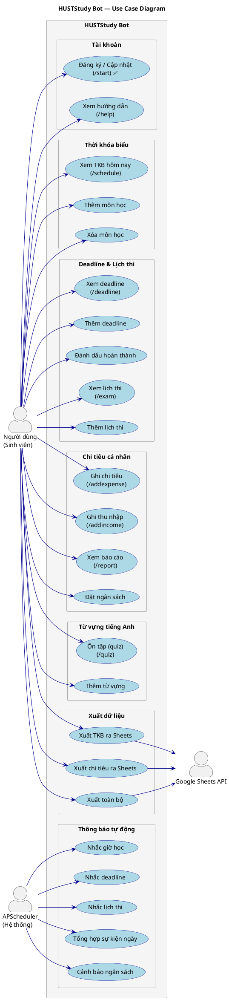

# Use Case Diagram — HUSTStudy Bot

## Tổng quan

Sơ đồ use case mô tả các tác nhân và ca sử dụng của hệ thống. Dựa trên danh sách lệnh đăng ký trong `bot/main.py` (`post_init`) và các handler đã/sẽ triển khai.

## Tác nhân (Actors)

| Tác nhân | Mô tả |
|---|---|
| **Người dùng (Sinh viên)** | Tương tác qua Telegram — gửi lệnh, nhận phản hồi |
| **APScheduler (Hệ thống)** | Python APScheduler chạy nền, kích hoạt thông báo định kỳ |
| **Google Sheets API** | Nhận dữ liệu xuất từ `SheetsService` (Java) |

## Sơ đồ

## Trạng thái triển khai

### ✅ Đã triển khai
| Use Case | Lệnh | File |
|---|---|---|
| UC01 — Đăng ký/Cập nhật | `/start` | `bot/handlers/start.py` + `UserController.java` |

### 📋 Đã đăng ký trong menu Telegram (main.py)
Các lệnh sau được đăng ký trong `post_init()` nhưng **chưa có handler**:

| Lệnh | Mô tả |
|---|---|
| `/schedule` | Xem thời khóa biểu hôm nay |
| `/deadline` | Xem deadline sắp tới |
| `/exam` | Xem lịch thi |
| `/addexpense` | Ghi chi tiêu |
| `/addincome` | Ghi thu nhập |
| `/report` | Báo cáo chi tiêu tháng này |
| `/quiz` | Ôn từ vựng tiếng Anh |
| `/help` | Hướng dẫn sử dụng |

### 🔲 Chưa triển khai
- Tất cả chức năng thêm/sửa/xóa dữ liệu (thêm môn, thêm deadline, thêm lịch thi, thêm từ vựng).
- Xuất dữ liệu ra Google Sheets (`SheetsService` mới là stub).
- APScheduler — chưa setup bất kỳ job nào.
- Cảnh báo ngân sách (logic đã thiết kế trong `budgets`, chưa có scheduler gọi).

## Mô tả nhóm chức năng

### 1. Tài khoản
- **UC01 — /start**: Gọi `POST /api/users/register` → tạo mới hoặc cập nhật user. Tạo đồng thời `user_settings` với giá trị mặc định.

### 2. Thời khóa biểu
- Quản lý bảng `subjects` và `class_schedules`. `day_of_week` dùng convention 1=Thứ2...7=CN.
- View `v_today_schedule` hỗ trợ query nhanh lịch hôm nay.

### 3. Deadline & Lịch thi
- `deadlines` có `priority` (LOW/MEDIUM/HIGH) và `status` (PENDING/DONE/OVERDUE).
- `exams` lưu `subject_name` riêng để không mất dữ liệu khi xóa môn.
- Cả hai có `is_notified` để tránh gửi thông báo trùng.

### 4. Chi tiêu cá nhân
- `expenses` → `expense_categories` (có 10 danh mục mặc định seeded).
- `budgets` có `warn_threshold` (default 0.80) và 2 cờ `is_notified_80/100`.
- View `v_budget_status` và `v_monthly_expense_summary` hỗ trợ báo cáo.

### 5. Từ vựng tiếng Anh
- Bảng `vocabularies` dùng **thuật toán SM-2** (Spaced Repetition): `review_interval`, `ease_factor`.
- `vocab_sessions` → nhiều `vocab_answers` (tách biệt session header và chi tiết từng câu).

### 6. Thông báo tự động (APScheduler)
- **UC20**: Đọc `class_schedules` + `user_settings.notify_class_remind` + `class_remind_before`.
- **UC21**: Đọc `deadlines` WHERE `status='PENDING'` + `notify_deadline`.
- **UC22**: Đọc `exams` + `notify_exam` + `remind_days`.
- **UC23**: Tổng hợp sự kiện ngày lúc `daily_summary_time` (default 07:00).
- **UC24**: Đọc view `v_budget_status`, gửi khi `spent_pct >= warn_threshold AND is_notified_80=0`.
- Mọi thông báo đã gửi được ghi vào `notification_logs`.
