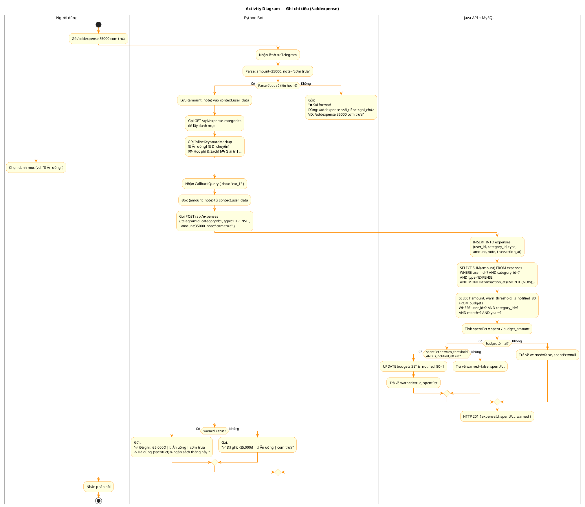
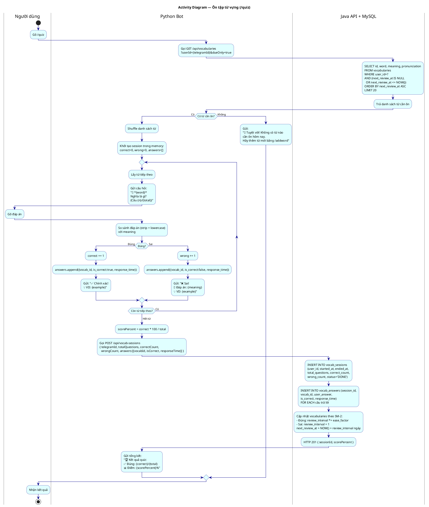

# Activity Diagram — HUSTStudy Bot

## Tổng quan

Sơ đồ hoạt động mô tả luồng xử lý của các chức năng chính, phân chia trách nhiệm giữa **Người dùng**, **Python Bot**, và **Java API + MySQL**.

Tên bảng/cột dùng đúng theo SQL thực tế (`V1__init_schema.sql`).

---

## Activity 1 — Ghi chi tiêu (/addexpense)

### Luồng chính
1. User gõ `/addexpense <số_tiền> <ghi_chú>`.
2. Bot parse tham số. Sai format → báo lỗi.
3. Bot hiển thị keyboard inline chọn danh mục (từ `expense_categories`).
4. Sau khi chọn, bot gọi `POST /api/expenses`.
5. API INSERT vào bảng `expenses`, tính `SUM(amount)` tháng hiện tại.
6. Kiểm tra `budgets.amount` và `warn_threshold` (default 0.80).
7. Nếu vượt ngưỡng và chưa gửi cảnh báo (`is_notified_80 = 0`) → gửi cảnh báo + cập nhật cờ.

### Điểm quyết định

| Điều kiện | True | False |
|---|---|---|
| Parse được số tiền? | Hiển thị keyboard danh mục | Gửi hướng dẫn lỗi |
| Ngân sách tồn tại? | Tính và kiểm tra threshold | Không cảnh báo |
| spentPct ≥ warn_threshold AND is_notified_80=0? | Cảnh báo + đánh dấu | Xác nhận thông thường |

---

## Activity 2 — Ôn tập từ vựng (/quiz)

### Luồng chính
1. User gõ `/quiz`.
2. Bot gọi API lấy từ cần ôn: `next_review_at <= NOW()` từ bảng `vocabularies`.
3. Nếu không có từ → thông báo hoàn thành.
4. Shuffle danh sách → vòng lặp quiz từng từ.
5. Mỗi câu: bot hỏi → user trả lời → kiểm tra (case-insensitive).
6. Kết thúc: INSERT `vocab_sessions`, INSERT nhiều `vocab_answers`, cập nhật `vocabularies` theo SM-2.

### Thuật toán SM-2 (Spaced Repetition)

| Trả lời | `review_interval` mới | `ease_factor` mới | `next_review_at` |
|---|---|---|---|
| Đúng | `interval × ease_factor` (làm tròn) | `ease_factor + 0.1` (tối đa 2.50) | `NOW() + interval ngày` |
| Sai | 1 ngày | `ease_factor - 0.2` (tối thiểu 1.30) | `NOW() + 1 ngày` |

- `ease_factor` khởi tạo: **2.50** (dễ), giảm dần khi hay sai.
- `review_interval` khởi tạo: **1 ngày**.
- Từ trả lời đúng liên tục → chu kỳ tăng: 1 → 2 → 5 → 12 → 30 ngày...
