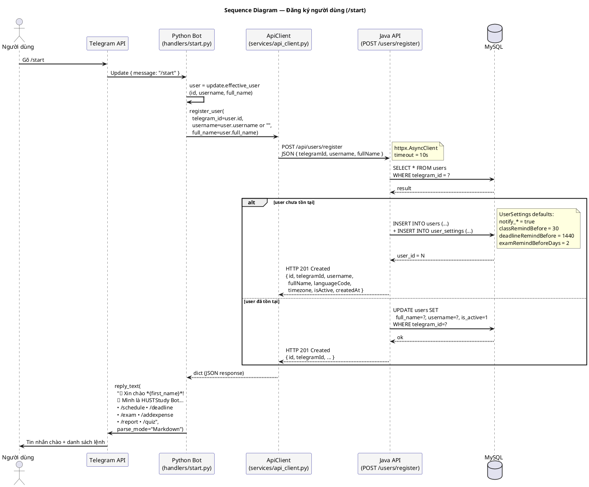
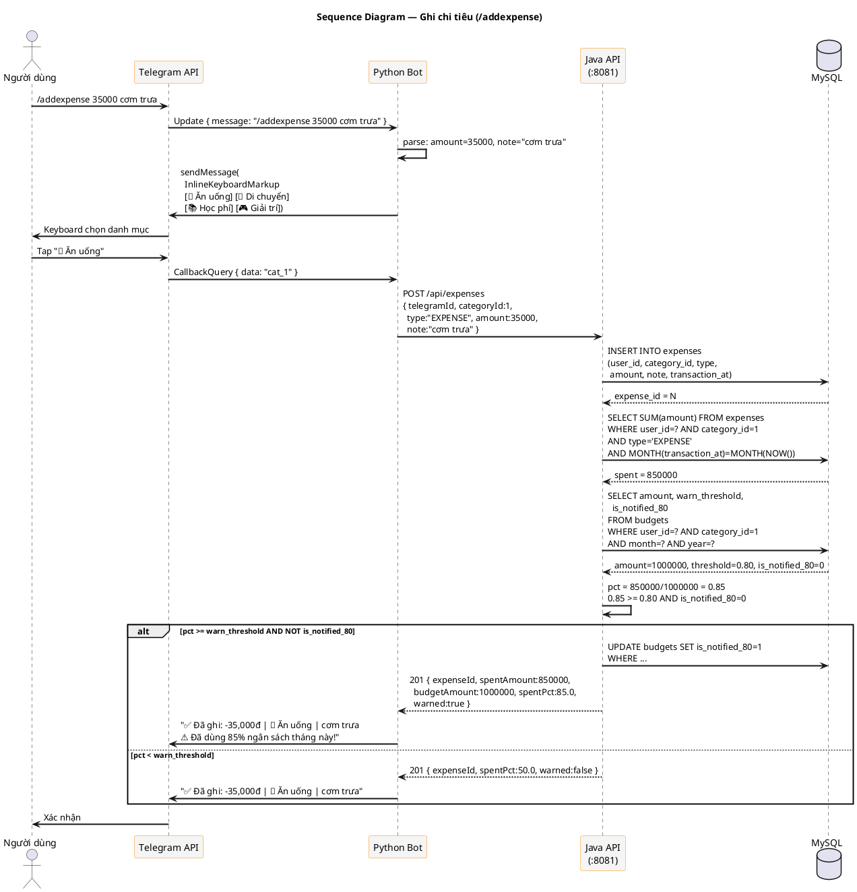
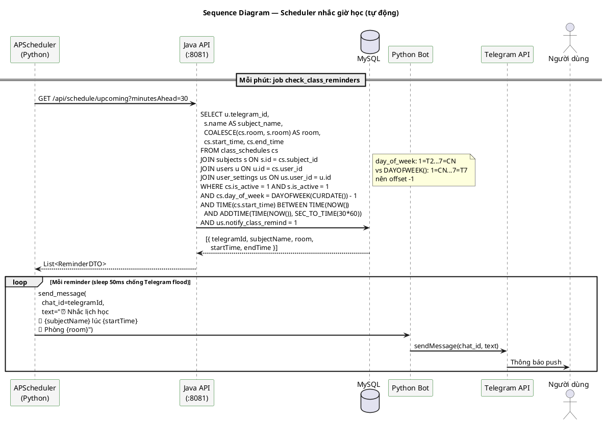

# Sequence Diagram — HUSTStudy Bot

## Tổng quan

Sơ đồ tuần tự mô tả tương tác giữa các thành phần theo thứ tự thời gian. Dựa trên source code thực tế: `bot/handlers/start.py`, `bot/services/api_client.py`, và `backend/.../UserController.java`.

**Base URL API:** `http://localhost:8081/api` (cấu hình trong `bot/config.py` qua `API_BASE_URL`)

---

## Sequence 1 — Đăng ký người dùng (/start)

### Đã triển khai trong code

- `bot/handlers/start.py` → `start_handler()`
- `bot/services/api_client.py` → `register_user()`
- `backend/.../UserController.java` → `POST /users/register`

### Ghi chú
- Python Bot dùng `httpx.AsyncClient` với `base_url = API_BASE_URL` và `timeout = 10.0` giây.
- `response.raise_for_status()` được gọi → nếu API trả lỗi HTTP ≥ 400, exception sẽ bubble up.
- API luôn trả `201 Created` cho cả create và update (thiết kế hiện tại).
- `UserResponse` bao gồm: `id`, `telegramId`, `username`, `fullName`, `languageCode`, `timezone`, `isActive`, `createdAt`.

---

## Sequence 2 — Ghi chi tiêu (/addexpense)

### Trạng thái: Thiết kế (handler chưa implement)

Endpoint Java cần tạo: `POST /api/expenses`

### Ghi chú
- `category_id` là INT (bảng `expense_categories` dùng `INT`, không phải `BIGINT`).
- `warn_threshold` default `0.80` — lấy từ cột trong `budgets`, không hardcode.
- Cờ `is_notified_80` ngăn gửi cảnh báo lặp lại trong cùng tháng.
- Bot lưu `amount` và `note` tạm trong `context.user_data` giữa 2 bước (lệnh → callback).

---

## Sequence 3 — Scheduler nhắc giờ học (tự động)

### Trạng thái: Thiết kế (APScheduler chưa implement)

Endpoint Java cần tạo: `GET /api/schedule/upcoming`

### Ghi chú
- `class_schedules.day_of_week`: 1=Thứ2, ..., 7=CN (quy ước riêng của dự án).
- MySQL `DAYOFWEEK()` trả 1=CN, 2=Thứ2, ..., 7=Thứ7 → phải offset `-1` khi query.
- Dùng view `v_today_schedule` đã có trong DB sẽ đơn giản hơn (view đã xử lý `DAYOFWEEK(CURDATE()) - 1`).
- Delay 50ms giữa các `sendMessage` để tránh vượt rate limit Telegram (30 msg/giây).
- Tương tự cho các scheduler khác: deadline (`notify_deadline`), exam (`notify_exam`), daily summary (`notify_daily_summary`).

---

## Tóm tắt endpoints đã implement

| Endpoint | Method | Handler Python | Controller Java | Trạng thái |
|---|---|---|---|---|
| `/api/users/register` | POST | `api_client.register_user()` | `UserController.register()` | ✅ Done |
| `/api/users/telegram/{id}` | GET | `api_client.get_user()` | `UserController.getByTelegramId()` | ✅ Done |
| `/api/users/exists/{id}` | GET | `api_client.user_exists()` | `UserController.exists()` | ✅ Done |
| `/api/expenses` | POST | — | — | 🔲 TODO |
| `/api/schedule/upcoming` | GET | — | — | 🔲 TODO |
| `/api/export/*` | POST | — | `SheetsService` (stub) | 🔲 TODO |
