# Class Diagram — HUSTStudy Bot (Java Backend)

## Tổng quan

Sơ đồ class dựa trên source code Java thực tế trong `backend/src/main/java/com/studybot/`. Kiến trúc phân lớp **Controller → Service → Repository → Entity** với Lombok annotations (`@Builder`, `@Getter`, `@Setter`).

> **Lưu ý về mapping tên bảng:** Một số Java entity dùng tên khác với tên bảng SQL thực tế — xem cột "Bảng SQL" trong mỗi module.

## Sơ đồ

```plantuml
@startuml class_diagram
title Class Diagram — HUSTStudy Bot (Java Backend)

skinparam ClassBackgroundColor WhiteSmoke
skinparam ClassBorderColor DarkBlue
skinparam ClassHeaderBackgroundColor #4A90D9
skinparam ArrowColor DarkBlue
skinparam NoteBackgroundColor LightYellow

' ══════════════════════════
'  MODULE: USER
' ══════════════════════════

package "com.studybot.user" #DDEEFF {

    class User <<@Entity\n@Table("users")>> {
        - id : Long
        - telegramId : Long
        - username : String
        - fullName : String
        - languageCode : String = "vi"
        - timezone : String = "Asia/Ho_Chi_Minh"
        - isActive : Boolean = true
        - createdAt : LocalDateTime
        - updatedAt : LocalDateTime
        - settings : UserSettings
        # onCreate() : void
        # onUpdate() : void
    }

    class UserSettings <<@Entity\n@Table("user_settings")>> {
        - id : Long
        - user : User
        - notifyClassRemind : Boolean = true
        - notifyDeadline : Boolean = true
        - notifyExam : Boolean = true
        - notifyBudgetWarn : Boolean = true
        - notifyDailySummary : Boolean = true
        - dailySummaryTime : LocalTime = 07:00
        - classRemindBefore : Short = 30
        - deadlineRemindBefore : Short = 1440
        - examRemindBeforeDays : Short = 2
        - updatedAt : LocalDateTime
        # onUpdate() : void
    }

    class UserRequest <<DTO>> {
        - telegramId : Long <<@NotNull>>
        - username : String
        - fullName : String <<@NotBlank>>
        - languageCode : String = "vi"
        - timezone : String = "Asia/Ho_Chi_Minh"
    }

    class UserResponse <<DTO>> {
        - id : Long
        - telegramId : Long
        - username : String
        - fullName : String
        - languageCode : String
        - timezone : String
        - isActive : Boolean
        - createdAt : LocalDateTime
        + {static} from(user: User) : UserResponse
    }

    interface UserRepository <<JpaRepository<User,Long>>> {
        + findByTelegramId(Long) : Optional<User>
        + existsByTelegramId(Long) : boolean
    }

    class UserService <<@Service\n@Transactional>> {
        - userRepository : UserRepository
        + registerOrUpdate(UserRequest) : UserResponse
        + getByTelegramId(Long) : UserResponse
        + existsByTelegramId(Long) : boolean
        - createNewUser(UserRequest) : User
    }

    class UserController <<@RestController\n@RequestMapping("/users")>> {
        - userService : UserService
        + register(UserRequest) : ResponseEntity<UserResponse>      <<POST /register>>
        + getByTelegramId(Long) : ResponseEntity<UserResponse>      <<GET /telegram/{id}>>
        + exists(Long) : ResponseEntity<Boolean>                    <<GET /exists/{id}>>
    }
}

' ══════════════════════════
'  MODULE: SCHEDULE
' ══════════════════════════

package "com.studybot.schedule" #DDFFD8 {

    class Subject <<@Entity\n@Table("subjects")>> {
        - id : Long
        - user : User
        - name : String
        - code : String
        - teacher : String
        - credits : Integer = 3
        - isActive : Boolean = true
    }

    note right of Subject
        Bảng SQL có thêm:
        room, semester, color, updated_at
        (chưa ánh xạ trong entity)
    end note

    class ClassSession <<@Entity\n@Table("class_sessions")>> {
        - id : Long
        - subject : Subject
        - dayOfWeek : Integer
        - startTime : String
        - endTime : String
        - room : String
        - weekType : String = "ALL"
    }

    note right of ClassSession
        Tên bảng SQL thực tế: class_schedules
        SQL có thêm: user_id FK, remind_before,
        is_active, start_time kiểu TIME
        SQL không có cột week_type
    end note
}

' ══════════════════════════
'  MODULE: DEADLINE
' ══════════════════════════

package "com.studybot.deadline" #FFEECC {

    class Deadline <<@Entity\n@Table("deadlines")>> {
        - id : Long
        - user : User
        - title : String
        - subject : String
        - dueDate : LocalDate
        - note : String
        - isDone : Boolean = false
        - createdAt : LocalDateTime
        # onCreate() : void
    }

    note right of Deadline
        SQL thực tế khác:
        subject_id FK (nullable) thay vì subject text
        description thay vì note
        due_date kiểu DATETIME
        Có thêm: priority, status, remind_before, is_notified
    end note
}

' ══════════════════════════
'  MODULE: EXAM
' ══════════════════════════

package "com.studybot.exam" #FFE0E0 {

    class Exam <<@Entity\n@Table("exams")>> {
        - id : Long
        - user : User
        - subject : String
        - examDate : LocalDate
        - startTime : LocalTime
        - durationMinutes : Integer
        - room : String
        - examType : String
        - note : String
        - createdAt : LocalDateTime
        # onCreate() : void
    }

    note right of Exam
        SQL thực tế khác:
        subject_name (NOT NULL) + subject_id FK nullable
        exam_date kiểu DATETIME (gộp ngày+giờ)
        duration_min thay vì durationMinutes
        exam_type là ENUM('MIDTERM','FINAL','MAKEUP','OTHER')
        Có thêm: remind_days, is_notified
    end note
}

' ══════════════════════════
'  MODULE: EXPENSE
' ══════════════════════════

package "com.studybot.expense" #FFD6D6 {

    class Category <<@Entity\n@Table("categories")>> {
        - id : Long
        - name : String
        - icon : String
        - description : String
        - isDefault : Boolean = false
    }

    note right of Category
        Tên bảng SQL thực tế: expense_categories
        SQL có thêm: user_id FK (nullable),
        type ENUM, is_active, sort_order
    end note

    class Transaction <<@Entity\n@Table("transactions")>> {
        - id : Long
        - user : User
        - category : Category
        - type : TransactionType
        - amount : BigDecimal
        - note : String
        - transactedAt : LocalDateTime
        - createdAt : LocalDateTime
        # onCreate() : void
    }

    note right of Transaction
        Tên bảng SQL thực tế: expenses
        SQL dùng transaction_at (không phải transacted_at)
        amount: DECIMAL(15,2) — có 2 chữ số thập phân
    end note

    enum TransactionType {
        EXPENSE
        INCOME
    }

    class Budget <<@Entity\n@Table("budgets")>> {
        - id : Long
        - user : User
        - category : Category
        - limitAmount : BigDecimal
        - month : Integer
        - year : Integer
    }

    note right of Budget
        SQL dùng amount thay vì limit_amount
        SQL có thêm: warn_threshold (default 0.80),
        is_notified_80, is_notified_100
        UNIQUE(user_id, category_id, month, year)
    end note
}

' ══════════════════════════
'  MODULE: VOCABULARY
' ══════════════════════════

package "com.studybot.vocabulary" #EDE0FF {

    class Word <<@Entity\n@Table("words")>> {
        - id : Long
        - user : User
        - word : String
        - meaning : String
        - example : String
        - pronunciation : String
        - level : Integer = 0
        - nextReviewAt : LocalDateTime
        - createdAt : LocalDateTime
        # onCreate() : void
    }

    note right of Word
        Tên bảng SQL thực tế: vocabularies
        SQL dùng SM-2: review_interval, ease_factor,
        times_seen, times_correct (không có cột level)
        SQL có thêm: category, updated_at
    end note

    class QuizResult <<@Entity\n@Table("quiz_results")>> {
        - id : Long
        - user : User
        - totalQuestions : Integer
        - correctAnswers : Integer
        - wrongAnswers : Integer
        - scorePercent : Integer
        - playedAt : LocalDateTime
        # onCreate() : void
    }

    note right of QuizResult
        SQL thực tế dùng 2 bảng tách biệt:
        vocab_sessions (session header)
        vocab_answers (chi tiết từng câu)
    end note
}

' ══════════════════════════
'  MODULE: SHEETS
' ══════════════════════════

package "com.studybot.sheets" #F5F5F5 {

    class SheetsService <<@Service>> {
        + exportSchedule(userId: Long, sheetId: String) : String
        + exportDeadlineAndExam(userId: Long, sheetId: String) : String
        + exportExpenseReport(userId: Long, sheetId: String, month: int, year: int) : String
        + exportAll(userId: Long, sheetId: String) : String
    }
}

' ══════════════════════════
'  RELATIONSHIPS
' ══════════════════════════

User "1" *-- "1" UserSettings      : has >
User "1" o-- "N" Subject           : owns >
User "1" o-- "N" Deadline          : owns >
User "1" o-- "N" Exam              : owns >
User "1" o-- "N" Transaction       : makes >
User "1" o-- "N" Budget            : sets >
User "1" o-- "N" Word              : learns >
User "1" o-- "N" QuizResult        : has >

Subject "1" *-- "N" ClassSession   : has >

Category "1" o-- "N" Transaction   : classifies >
Category "1" o-- "N" Budget        : limits >
Transaction --> TransactionType    : uses

UserController ..> UserService     : <<uses>>
UserService    ..> UserRepository  : <<uses>>
UserService    ..> UserRequest     : <<receives>>
UserService    ..> UserResponse    : <<returns>>

@enduml
```



## Mô tả chi tiết

### Module: user — Đã triển khai đầy đủ

| Lớp | Annotation chính | Endpoint |
|---|---|---|
| `User` | `@Entity`, `@Table("users")` | — |
| `UserSettings` | `@Entity`, `@Table("user_settings")` | — |
| `UserRequest` | DTO + `@NotNull`, `@NotBlank` | — |
| `UserResponse` | DTO + `from(User)` factory | — |
| `UserRepository` | `JpaRepository<User, Long>` | — |
| `UserService` | `@Service`, `@Transactional` | — |
| `UserController` | `@RestController("/users")` | POST `/register`, GET `/telegram/{id}`, GET `/exists/{id}` |

**Logic `registerOrUpdate`:** Tìm user theo `telegramId` → nếu không có thì tạo mới kèm `UserSettings` mặc định; nếu có thì cập nhật `fullName`, `username`, `isActive = true`.

### Module: schedule — Entity có, chưa có Controller/Service

`Subject` và `ClassSession` là các entity JPA đã định nghĩa. Tên bảng SQL thực tế là **`class_schedules`** (entity đang khai báo sai `@Table("class_sessions")`).

### Module: deadline / exam — Entity có, SQL khác biệt

Cả `Deadline` và `Exam` có entity Java nhưng cấu trúc field không khớp hoàn toàn với SQL migration:
- `Deadline` thiếu `priority`, `status`, `remind_before`, `is_notified`; `subject` là text thay vì FK
- `Exam` tách `examDate + startTime` nhưng SQL dùng 1 cột `exam_date DATETIME`

### Module: expense — Entity có, tên bảng/cột khác

- Java `Category` → SQL `expense_categories`
- Java `Transaction` → SQL `expenses`; cột `transactedAt` ≠ SQL `transaction_at`

### Module: vocabulary — Entity chưa khớp với SQL

- Java `Word` → SQL `vocabularies` dùng SM-2 algorithm (khác hoàn toàn cấu trúc field)
- Java `QuizResult` → SQL tách thành `vocab_sessions` + `vocab_answers`

### Module: sheets — Stub, chưa implement

`SheetsService` có 4 method nhưng toàn bộ là `// TODO` — chưa tích hợp Google Sheets API thực tế.

## Kiến trúc phân lớp

```
Controller  →  Service  →  Repository  →  Entity  →  MySQL
   (HTTP)      (Logic)      (JPA/SQL)    (@Table)     (Flyway)
```

Module `user` là module duy nhất đã triển khai đầy đủ 4 lớp. Các module còn lại mới có Entity layer.
