# ERD — HUSTStudy Bot (MySQL Database)

## Tổng quan

Sơ đồ quan hệ thực thể dựa trên file migration `V1__init_schema.sql`. Database gồm **13 bảng** và **5 view** tổ chức theo 5 module chức năng, tất cả liên kết về bảng trung tâm `users`.

## Sơ đồ

```plantuml
@startuml erd
title ERD — HUSTStudy Bot (MySQL Database)

skinparam linetype ortho
skinparam roundcorner 5
skinparam ClassBackgroundColor WhiteSmoke
skinparam ClassBorderColor DarkGray

' ══════════════════════════
'  MODULE: USER
' ══════════════════════════

entity "users" as users #DDEEFF {
    * id : BIGINT <<PK, AUTO_INCREMENT>>
    --
    * telegram_id : BIGINT <<UNIQUE>>
    username : VARCHAR(100)
    * full_name : VARCHAR(255)
    language_code : VARCHAR(10) = 'vi'
    timezone : VARCHAR(50) = 'Asia/Ho_Chi_Minh'
    * is_active : TINYINT(1) = 1
    * created_at : DATETIME
    * updated_at : DATETIME
}

entity "user_settings" as user_settings #DDEEFF {
    * id : BIGINT <<PK>>
    --
    * user_id : BIGINT <<FK, UNIQUE>>
    notify_class_remind : TINYINT(1) = 1
    notify_deadline : TINYINT(1) = 1
    notify_exam : TINYINT(1) = 1
    notify_budget_warn : TINYINT(1) = 1
    notify_daily_summary : TINYINT(1) = 1
    daily_summary_time : TIME = '07:00:00'
    class_remind_before : SMALLINT = 30
    deadline_remind_before : SMALLINT = 1440
    exam_remind_before_days : TINYINT = 2
    * updated_at : DATETIME
}

entity "notification_logs" as notification_logs #DDEEFF {
    * id : BIGINT <<PK>>
    --
    * user_id : BIGINT <<FK>>
    * type : ENUM('CLASS_REMIND','DEADLINE_REMIND',\n'EXAM_REMIND','BUDGET_WARN','DAILY_SUMMARY')
    ref_id : BIGINT
    message : TEXT
    * sent_at : DATETIME
    status : ENUM('SENT','FAILED') = 'SENT'
}

' ══════════════════════════
'  MODULE: SCHEDULE
' ══════════════════════════

entity "subjects" as subjects #DDFFD8 {
    * id : BIGINT <<PK>>
    --
    * user_id : BIGINT <<FK>>
    * name : VARCHAR(255)
    code : VARCHAR(50)
    teacher : VARCHAR(255)
    room : VARCHAR(50)
    credits : TINYINT = 3
    semester : VARCHAR(20)
    color : VARCHAR(7) = '#4A90D9'
    * is_active : TINYINT(1) = 1
    * created_at : DATETIME
    * updated_at : DATETIME
}

entity "class_schedules" as class_schedules #DDFFD8 {
    * id : BIGINT <<PK>>
    --
    * subject_id : BIGINT <<FK>>
    * user_id : BIGINT <<FK>>
    * day_of_week : TINYINT
    * start_time : TIME
    * end_time : TIME
    room : VARCHAR(50)
    remind_before : SMALLINT = 30
    * is_active : TINYINT(1) = 1
    * created_at : DATETIME
    * updated_at : DATETIME
}

note right of class_schedules
    day_of_week:
    1=Thứ2, 2=Thứ3, 3=Thứ4
    4=Thứ5, 5=Thứ6, 6=Thứ7, 7=CN
end note

' ══════════════════════════
'  MODULE: DEADLINE
' ══════════════════════════

entity "deadlines" as deadlines #FFEECC {
    * id : BIGINT <<PK>>
    --
    * user_id : BIGINT <<FK>>
    subject_id : BIGINT <<FK, nullable>>
    * title : VARCHAR(255)
    description : TEXT
    * due_date : DATETIME
    priority : ENUM('LOW','MEDIUM','HIGH') = 'MEDIUM'
    status : ENUM('PENDING','DONE','OVERDUE') = 'PENDING'
    remind_before : SMALLINT = 1440
    is_notified : TINYINT(1) = 0
    * created_at : DATETIME
    * updated_at : DATETIME
}

' ══════════════════════════
'  MODULE: EXAM
' ══════════════════════════

entity "exams" as exams #FFE8CC {
    * id : BIGINT <<PK>>
    --
    * user_id : BIGINT <<FK>>
    subject_id : BIGINT <<FK, nullable>>
    * subject_name : VARCHAR(255)
    * exam_date : DATETIME
    duration_min : SMALLINT = 90
    room : VARCHAR(50)
    exam_type : ENUM('MIDTERM','FINAL','MAKEUP','OTHER') = 'FINAL'
    note : TEXT
    remind_days : TINYINT = 2
    is_notified : TINYINT(1) = 0
    * created_at : DATETIME
    * updated_at : DATETIME
}

' ══════════════════════════
'  MODULE: EXPENSE
' ══════════════════════════

entity "expense_categories" as expense_categories #FFD6D6 {
    * id : INT <<PK>>
    --
    user_id : BIGINT <<FK, nullable>>
    * name : VARCHAR(100)
    icon : VARCHAR(10)
    type : ENUM('EXPENSE','INCOME','BOTH') = 'EXPENSE'
    is_default : TINYINT(1) = 0
    is_active : TINYINT(1) = 1
    sort_order : TINYINT = 0
}

note right of expense_categories
    user_id = NULL → danh mục
    hệ thống mặc định
end note

entity "expenses" as expenses #FFD6D6 {
    * id : BIGINT <<PK>>
    --
    * user_id : BIGINT <<FK>>
    * category_id : INT <<FK>>
    * type : ENUM('EXPENSE','INCOME') = 'EXPENSE'
    * amount : DECIMAL(15,2)
    note : VARCHAR(500)
    * transaction_at : DATETIME
    * created_at : DATETIME
    * updated_at : DATETIME
}

entity "budgets" as budgets #FFD6D6 {
    * id : BIGINT <<PK>>
    --
    * user_id : BIGINT <<FK>>
    * category_id : INT <<FK>>
    * month : TINYINT
    * year : SMALLINT
    * amount : DECIMAL(15,2)
    warn_threshold : DECIMAL(4,2) = 0.80
    is_notified_80 : TINYINT(1) = 0
    is_notified_100 : TINYINT(1) = 0
    * created_at : DATETIME
    * updated_at : DATETIME
}

note bottom of budgets
    UNIQUE(user_id, category_id, month, year)
end note

' ══════════════════════════
'  MODULE: VOCABULARY
' ══════════════════════════

entity "vocabularies" as vocabularies #EDE0FF {
    * id : BIGINT <<PK>>
    --
    * user_id : BIGINT <<FK>>
    * word : VARCHAR(255)
    * meaning : TEXT
    pronunciation : VARCHAR(255)
    example : TEXT
    category : VARCHAR(100)
    next_review_at : DATETIME
    review_interval : SMALLINT = 1
    ease_factor : DECIMAL(4,2) = 2.50
    times_seen : INT = 0
    times_correct : INT = 0
    * created_at : DATETIME
    * updated_at : DATETIME
}

note right of vocabularies
    SM-2 Spaced Repetition:
    review_interval = chu kỳ (ngày)
    ease_factor = hệ số dễ/khó
end note

entity "vocab_sessions" as vocab_sessions #EDE0FF {
    * id : BIGINT <<PK>>
    --
    * user_id : BIGINT <<FK>>
    * started_at : DATETIME
    ended_at : DATETIME
    total_questions : INT = 0
    correct_count : INT = 0
    wrong_count : INT = 0
    status : ENUM('IN_PROGRESS','DONE','ABANDONED') = 'IN_PROGRESS'
}

entity "vocab_answers" as vocab_answers #EDE0FF {
    * id : BIGINT <<PK>>
    --
    * session_id : BIGINT <<FK>>
    * vocab_id : BIGINT <<FK>>
    user_answer : TEXT
    * is_correct : TINYINT(1) = 0
    response_time : SMALLINT
    * answered_at : DATETIME
}

' ══════════════════════════
'  RELATIONSHIPS
' ══════════════════════════

users               ||--||  user_settings       : "1 - 1"
users               ||--o{  notification_logs   : "1 - N"
users               ||--o{  subjects            : "1 - N"
users               ||--o{  class_schedules     : "1 - N"
users               ||--o{  deadlines           : "1 - N"
users               ||--o{  exams               : "1 - N"
users               ||--o{  expenses            : "1 - N"
users               ||--o{  budgets             : "1 - N"
users               ||--o{  vocabularies        : "1 - N"
users               ||--o{  vocab_sessions      : "1 - N"

subjects            ||--o{  class_schedules     : "1 - N"
subjects            |o--o{  deadlines           : "0..1 - N"
subjects            |o--o{  exams               : "0..1 - N"

expense_categories  ||--o{  expenses            : "1 - N"
expense_categories  ||--o{  budgets             : "1 - N"
users               |o--o{  expense_categories  : "custom cats"

vocab_sessions      ||--o{  vocab_answers       : "1 - N"
vocabularies        ||--o{  vocab_answers       : "1 - N"

@enduml
```

## Mô tả các bảng

### Module: User

#### `users`
| Cột | Kiểu | Ràng buộc | Ghi chú |
|---|---|---|---|
| `id` | BIGINT | PK AUTO_INCREMENT | |
| `telegram_id` | BIGINT | UNIQUE NOT NULL | Telegram chat_id |
| `username` | VARCHAR(100) | nullable | @username Telegram |
| `full_name` | VARCHAR(255) | NOT NULL | |
| `language_code` | VARCHAR(10) | default 'vi' | |
| `timezone` | VARCHAR(50) | default 'Asia/Ho_Chi_Minh' | |
| `is_active` | TINYINT(1) | default 1 | Soft delete |

#### `user_settings`
| Cột | Kiểu | Default | Ghi chú |
|---|---|---|---|
| `user_id` | BIGINT | FK UNIQUE | ON DELETE CASCADE |
| `notify_*` | TINYINT(1) | 1 | 5 cờ bật/tắt thông báo |
| `daily_summary_time` | TIME | 07:00:00 | Giờ gửi tổng hợp |
| `class_remind_before` | SMALLINT | 30 | Phút trước giờ học |
| `deadline_remind_before` | SMALLINT | 1440 | Phút (= 1 ngày) |
| `exam_remind_before_days` | TINYINT | 2 | Ngày trước khi thi |

#### `notification_logs`
Lịch sử tất cả thông báo đã gửi. `ref_id` trỏ đến ID bản ghi liên quan (deadline, exam...).

---

### Module: Schedule

#### `subjects`
| Cột thêm so với thiết kế ban đầu | Ghi chú |
|---|---|
| `room` | Phòng học mặc định của môn (có thể override ở `class_schedules`) |
| `semester` | Học kỳ (vd: "2024-1") |
| `color` | Mã màu hex để hiển thị trên UI |
| `updated_at` | Tự cập nhật ON UPDATE |

#### `class_schedules`
> **Lưu ý:** Tên bảng thực tế là `class_schedules`, không phải `class_sessions`.

| Cột | Ghi chú |
|---|---|
| `user_id` | FK trực tiếp đến users (ngoài subject_id) — để query nhanh theo user |
| `day_of_week` | **1=Thứ2, 2=Thứ3, ..., 7=CN** (khác với MySQL `DAYOFWEEK()`) |
| `start_time` / `end_time` | Kiểu `TIME` (không phải VARCHAR) |
| `remind_before` | Override nhắc trước X phút riêng cho buổi này |
| `room` | Override phòng học riêng cho buổi này |

---

### Module: Deadline

#### `deadlines`
| Cột | Kiểu | Ghi chú |
|---|---|---|
| `subject_id` | BIGINT FK nullable | ON DELETE SET NULL |
| `description` | TEXT | Mô tả chi tiết (thay vì `note`) |
| `due_date` | DATETIME | Có cả giờ, không chỉ ngày |
| `priority` | ENUM | LOW / MEDIUM / HIGH |
| `status` | ENUM | PENDING / DONE / OVERDUE |
| `remind_before` | SMALLINT | Override nhắc riêng (phút) |
| `is_notified` | TINYINT(1) | Đã gửi thông báo chưa |

---

### Module: Exam

#### `exams`
| Cột | Kiểu | Ghi chú |
|---|---|---|
| `subject_id` | BIGINT FK nullable | ON DELETE SET NULL (giữ lại khi xóa môn) |
| `subject_name` | VARCHAR(255) NOT NULL | Lưu riêng tên môn để không mất khi xóa `subjects` |
| `exam_date` | DATETIME | Bao gồm cả giờ thi (không tách `start_time`) |
| `duration_min` | SMALLINT | Thời lượng phút, default 90 |
| `exam_type` | ENUM | MIDTERM / FINAL / MAKEUP / OTHER |
| `remind_days` | TINYINT | Nhắc trước N ngày |
| `is_notified` | TINYINT(1) | Đã gửi thông báo chưa |

---

### Module: Expense

#### `expense_categories`
> **Lưu ý:** Tên bảng thực tế là `expense_categories`, không phải `categories`.

| Cột | Ghi chú |
|---|---|
| `user_id` | NULL = danh mục hệ thống; có giá trị = danh mục riêng user tạo |
| `type` | EXPENSE / INCOME / BOTH |
| `is_active` | Soft delete |
| `sort_order` | Thứ tự hiển thị |

**Danh mục mặc định (seed V2):** Ăn uống 🍜, Di chuyển 🚌, Học phí & Sách 📚, Giải trí 🎮, Mua sắm 🛍️, Y tế 💊, Khác 📦, Học bổng 🎓, Lương/Trợ cấp 💵, Thu nhập khác 💰.

#### `expenses`
> **Lưu ý:** Tên bảng thực tế là `expenses`, không phải `transactions`. Cột thời gian là `transaction_at`.

| Cột | Ghi chú |
|---|---|
| `amount` | DECIMAL(15,**2**) — lưu 2 chữ số thập phân |
| `transaction_at` | Thời điểm giao dịch thực tế |
| `category_id` | NOT NULL (bắt buộc phân loại) |

#### `budgets`
| Cột | Ghi chú |
|---|---|
| `amount` | Hạn mức (thay vì `limit_amount`) |
| `warn_threshold` | Ngưỡng cảnh báo, default 0.80 (80%) |
| `is_notified_80` | Đã gửi cảnh báo 80% chưa |
| `is_notified_100` | Đã gửi cảnh báo 100% chưa |
| UNIQUE | `(user_id, category_id, month, year)` |

---

### Module: Vocabulary

#### `vocabularies`
> **Lưu ý:** Tên bảng thực tế là `vocabularies`, không phải `words`. Dùng thuật toán **SM-2** thay vì `level` đơn giản.

| Cột | Ghi chú |
|---|---|
| `review_interval` | Chu kỳ ôn tập (ngày), default 1 |
| `ease_factor` | Hệ số độ khó SM-2, default 2.50 |
| `times_seen` | Tổng số lần đã gặp |
| `times_correct` | Tổng số lần trả lời đúng |
| `category` | Nhóm từ (vd: "Công nghệ", "Giao tiếp") |

#### `vocab_sessions`
Mỗi phiên quiz là 1 bản ghi. Trạng thái: IN_PROGRESS → DONE hoặc ABANDONED.

#### `vocab_answers`
Chi tiết từng câu trả lời trong phiên quiz. `response_time` = thời gian trả lời tính bằng giây.

---

## Views tổng hợp

| View | Mục đích |
|---|---|
| `v_today_schedule` | Lịch học hôm nay (join class_schedules + subjects) |
| `v_upcoming_deadlines` | Deadline trong 7 ngày tới, status = PENDING |
| `v_upcoming_exams` | Lịch thi trong 30 ngày tới |
| `v_monthly_expense_summary` | Tổng chi theo danh mục, tháng/năm |
| `v_budget_status` | Trạng thái ngân sách: spent%, warn flags |

## Quan hệ tổng hợp

| Quan hệ | Loại | ON DELETE |
|---|---|---|
| users — user_settings | 1-1 | CASCADE |
| users — subjects | 1-N | CASCADE |
| users — class_schedules | 1-N | CASCADE |
| subjects — class_schedules | 1-N | CASCADE |
| users — deadlines | 1-N | CASCADE |
| subjects — deadlines | 0..1-N | SET NULL |
| users — exams | 1-N | CASCADE |
| subjects — exams | 0..1-N | SET NULL |
| users — expenses | 1-N | CASCADE |
| expense_categories — expenses | 1-N | RESTRICT |
| expense_categories — budgets | 1-N | CASCADE |
| users — vocabularies | 1-N | CASCADE |
| users — vocab_sessions | 1-N | CASCADE |
| vocab_sessions — vocab_answers | 1-N | CASCADE |
| vocabularies — vocab_answers | 1-N | CASCADE |
| users — notification_logs | 1-N | CASCADE |
